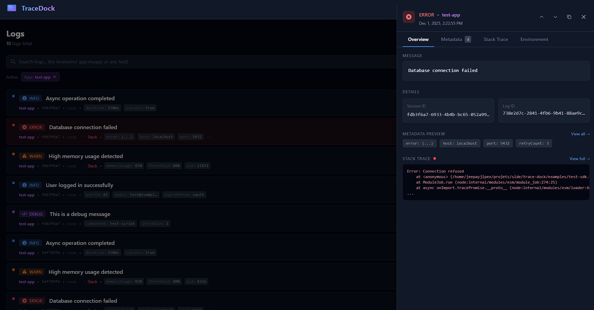

# 🚀 Trace Dock

A complete logging solution with SDK, server, and web UI for real-time log monitoring.



## ✨ Features

- **📦 SDK** - JavaScript/TypeScript logger for Node.js, Browser, and Tauri
- **🔌 Server** - High-performance API with WebSocket real-time streaming
- **🖥️ Web UI** - Beautiful dark-themed dashboard with live updates
- **🐳 Docker** - One-command deployment with Docker Compose

## 📁 Project Structure

```
/trace-dock
├── packages/
│   └── sdk/          # TypeScript SDK for logging
├── server/           # Hono API server with WebSocket
├── web/              # Vue 3 + Vite web interface
├── docker-compose.yml
└── package.json
```

## 🚀 Quick Start

### Prerequisites

- Node.js 20+
- pnpm 8+

### Installation

```bash
# Clone the repository
git clone https://github.com/JeepayJipex/trace-dock.git
cd trace-dock

# Install dependencies
pnpm install
```

### Development

```bash
# Start both server and web UI
pnpm dev

# Or start individually
pnpm dev:server  # Server on http://localhost:3000
pnpm dev:web     # Web UI on http://localhost:5173
```

### Docker Deployment

```bash
# Build and start all services
pnpm docker:up

# Or using docker-compose directly
docker-compose up -d --build

# View logs
docker-compose logs -f

# Stop services
pnpm docker:down
```

Access the application:
- **Web UI**: http://localhost:8080
- **API**: http://localhost:3000
- **WebSocket**: ws://localhost:3000/live

## 📦 SDK Usage

### Installation

```bash
npm install @trace-dock/sdk
# or
pnpm add @trace-dock/sdk
# or
yarn add @trace-dock/sdk
```

### Basic Usage

```typescript
import { createLogger } from '@trace-dock/sdk';

const logger = createLogger({
  endpoint: 'http://localhost:3000/ingest',
  appName: 'my-app',
});

// Log messages
logger.debug('Debug message', { extra: 'data' });
logger.info('User logged in', { userId: 123 });
logger.warn('High memory usage', { usage: '85%' });
logger.error('Database connection failed', { error: new Error('Connection refused') });
```

### Configuration Options

```typescript
const logger = createLogger({
  // Required
  endpoint: 'http://localhost:3000/ingest',
  appName: 'my-app',
  
  // Optional
  sessionId: 'custom-session-id',      // Auto-generated if not provided
  enableWebSocket: true,                // Enable real-time streaming
  wsEndpoint: 'ws://localhost:3000/live',
  batchSize: 10,                        // Batch logs before sending
  flushInterval: 5000,                  // Flush interval in ms
  maxRetries: 3,                        // Max retry attempts
  debug: false,                         // Console log in development
  
  // Global metadata added to all logs
  metadata: {
    version: '1.0.0',
    environment: 'production',
  },
  
  // Error handler
  onError: (error) => {
    console.error('Logger error:', error);
  },
});
```

### Child Loggers

```typescript
// Create a child logger with additional context
const userLogger = logger.child({
  userId: 123,
  module: 'auth',
});

userLogger.info('User action'); // Includes userId and module
```

### Session Management

```typescript
// Get current session ID
const sessionId = logger.getSessionId();

// Set new session ID (e.g., after user login)
logger.setSessionId('new-session-id');
```

### Browser Usage

```html
<script type="module">
  import { createLogger } from '@trace-dock/sdk';
  
  const logger = createLogger({
    endpoint: '/api/ingest',
    appName: 'web-app',
  });
  
  window.onerror = (message, source, line, col, error) => {
    logger.error('Uncaught error', { message, source, line, col, error });
  };
  
  logger.info('App initialized');
</script>
```

### Node.js Usage

```typescript
import { createLogger } from '@trace-dock/sdk';

const logger = createLogger({
  endpoint: 'http://localhost:3000/ingest',
  appName: 'node-app',
});

process.on('uncaughtException', (error) => {
  logger.error('Uncaught exception', { error });
  process.exit(1);
});

process.on('unhandledRejection', (reason) => {
  logger.error('Unhandled rejection', { reason });
});

logger.info('Server started', { port: 3000 });
```

### Tauri Usage

```typescript
import { createLogger } from '@trace-dock/sdk';

const logger = createLogger({
  endpoint: 'http://localhost:3000/ingest',
  appName: 'tauri-app',
});

// Tauri environment is auto-detected
logger.info('Tauri app started');
```

## 🔌 API Reference

### Server Endpoints

#### `POST /ingest`
Ingest a new log entry.

```bash
curl -X POST http://localhost:3000/ingest \
  -H "Content-Type: application/json" \
  -d '{
    "id": "uuid",
    "timestamp": "2024-01-01T00:00:00.000Z",
    "level": "info",
    "message": "Test log",
    "appName": "test-app",
    "sessionId": "session-123",
    "environment": { "type": "node" }
  }'
```

#### `GET /logs`
Fetch logs with pagination and filtering.

```bash
# Get all logs
curl http://localhost:3000/logs

# With filters
curl "http://localhost:3000/logs?level=error&appName=my-app&limit=100&offset=0"
```

Query Parameters:
- `level` - Filter by log level (debug, info, warn, error)
- `appName` - Filter by application name
- `sessionId` - Filter by session ID
- `search` - Full-text search
- `startDate` - Filter by start date (ISO format)
- `endDate` - Filter by end date (ISO format)
- `limit` - Number of results (default: 50, max: 1000)
- `offset` - Pagination offset

#### `GET /logs/:id`
Get a single log entry by ID.

#### `GET /stats`
Get log statistics.

```json
{
  "total": 1234,
  "byLevel": { "debug": 100, "info": 800, "warn": 200, "error": 134 },
  "byApp": { "my-app": 1000, "other-app": 234 }
}
```

#### `GET /apps`
Get list of unique application names.

#### `GET /sessions`
Get list of session IDs.

#### `WebSocket /live`
Real-time log streaming.

```javascript
const ws = new WebSocket('ws://localhost:3000/live');

ws.onmessage = (event) => {
  const { type, data } = JSON.parse(event.data);
  if (type === 'log') {
    console.log('New log:', data);
  }
};
```

## 🖥️ Web UI Features

- **Live Mode** - Real-time log streaming via WebSocket
- **Filtering** - Filter by level, app, session, date range, and text search
- **Detail View** - Expandable log entries with full metadata and stack traces
- **Dark Theme** - Beautiful dark UI optimized for readability
- **Responsive** - Works on desktop and mobile

## 🛠️ Development

### Build All Packages

```bash
pnpm build
```

### Build Individual Packages

```bash
pnpm build:sdk
pnpm build:server
pnpm build:web
```

### Testing

```bash
# Generate test logs
node -e "
const { createLogger } = require('./packages/sdk/dist');
const logger = createLogger({
  endpoint: 'http://localhost:3000/ingest',
  appName: 'test'
});
logger.info('Test log');
logger.error('Test error', { error: new Error('Test') });
"
```

## 📝 Environment Variables

### Server

| Variable | Default | Description |
|----------|---------|-------------|
| `PORT` | `3000` | Server port |
| `DATA_DIR` | `./data` | SQLite database directory |
| `DB_PATH` | `${DATA_DIR}/trace-dock.sqlite` | Database file path |

### Web

| Variable | Default | Description |
|----------|---------|-------------|
| `VITE_API_URL` | `/api` | API base URL |
| `VITE_WS_URL` | Auto-detected | WebSocket URL |

## 🐳 Docker Configuration

### Custom Configuration

Create a `.env` file:

```env
# Server
PORT=3000

# Web
VITE_API_URL=/api
```

### Volume Mounts

The SQLite database is persisted in a Docker volume:

```yaml
volumes:
  trace-dock-data:
    driver: local
```

### Health Checks

Both services include health checks:
- Server: `GET /`
- Web: `GET /`

## 📄 License

MIT License - see [LICENSE](LICENSE) for details.

## 🤝 Contributing

1. Fork the repository
2. Create a feature branch (`git checkout -b feature/amazing-feature`)
3. Commit your changes (`git commit -m 'Add amazing feature'`)
4. Push to the branch (`git push origin feature/amazing-feature`)
5. Open a Pull Request

---

Made with ❤️ by the Trace Dock team
